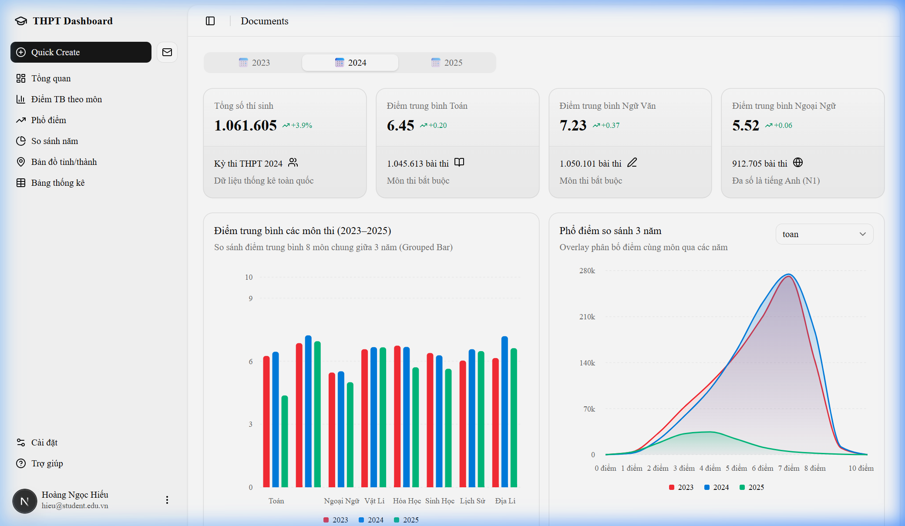
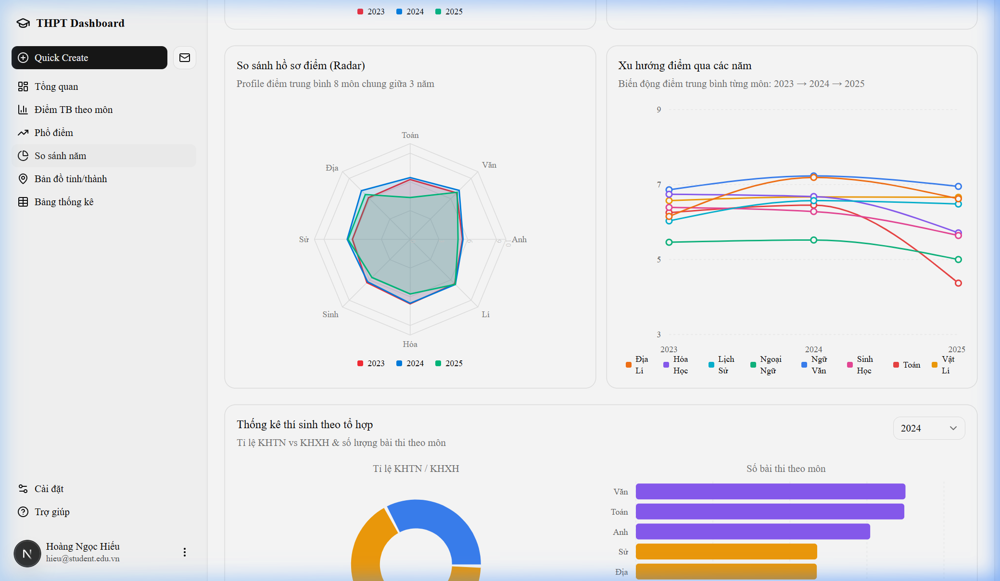
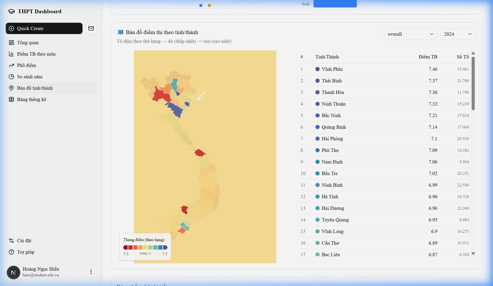

# 📊 Vietnam THPT Exam Dashboard (2023–2025)

A high-performance, interactive data visualization dashboard for analyzing Vietnam's National High School Graduation Examination (THPT) results across three consecutive years (2023, 2024, and 2025).


---

## 📸 Demo Screenshots

### Dashboard Overview — KPI Cards, Grouped Bar Chart & Score Distribution


### Radar Chart & Subject Trend Line — Multi-Year Comparison


### Interactive Choropleth Map — Province Rankings


---

## 🌟 English Version

### Key Features
- **Interactive Choropleth Map**: Visualize exam performance across all 63 provinces using D3.js with quantile-based color scaling.
- **Multi-Year Comparison**: Dynamic charts (Bar, Area, Radar, Line) to compare subject scores and trends from 2023 to 2025.
- **Advanced Statistics**: Detailed breakdown of Mean, Median, Mode, Standard Deviation, and performance tiers.
- **Offline Data Processing**: High-speed Node.js scripts to process millions of raw records into optimized JSON payloads.
- **Responsive UI/UX**: Built with Shadcn UI and Tailwind CSS 4, supporting both Light and Dark modes.

### 🛠 Tech Stack

| Category | Technology | Version |
|---|---|---|
| **Core Framework** | [Next.js](https://nextjs.org/) (App Router) | 16.2.4 |
| **UI Library** | [React](https://react.dev/) | 19.2.4 |
| **Language** | [TypeScript](https://www.typescriptlang.org/) | ^5 |
| **Styling** | [Tailwind CSS v4](https://tailwindcss.com/), [Shadcn UI](https://ui.shadcn.com/) | ^4 |
| **Charts** | [Recharts](https://recharts.org/) | ^3.8.0 |
| **Maps** | [D3.js](https://d3js.org/) (d3-geo) | ^3.1.1 |
| **Data Processing** | Node.js, `csv-parser`, `xlsx` | — |
| **Icons** | [Lucide React](https://lucide.dev/) | ^1.8.0 |

### 📋 Requirements

- **Node.js** >= 18.0
- **npm** (or yarn / pnpm / bun)
- **Raw Data Files** (placed in the **parent directory** `../`):
  - `diem_thi_thpt_2023.csv` (~40 MB, ~1M rows)
  - `diem_thi_thpt_2024.csv` (~42 MB, ~1M rows)
  - `20250715-ketquathi-ct2018a.xlsx` (~79 MB, 2025 data)

### 🚀 Getting Started

```bash
# 1. Clone & Install
git clone https://github.com/hoangngochieu/thpt-dashboard.git
cd thpt-dashboard
npm install

# 2. Pre-process raw data (run once)
node scripts/process-data.js
node scripts/process-province-data.js

# 3. Start dev server
npm run dev
# Open http://localhost:3000
```

### 📂 Project Structure

```
thpt-dashboard/
├── scripts/                  # Offline data processing (Node.js)
│   ├── process-data.js       # National statistics → data.json
│   └── process-province-data.js # Provincial stats → province-data.json
├── public/
│   └── vietnam-simplified.geojson  # Vietnam GeoJSON map data
├── src/
│   ├── app/
│   │   ├── layout.tsx        # Root layout, metadata, fonts
│   │   ├── globals.css       # Design tokens, OKLCH colors, dark mode
│   │   └── dashboard/
│   │       ├── page.tsx      # Main dashboard page (assembles all components)
│   │       ├── data.json     # Pre-processed national data (~20 KB)
│   │       └── province-data.json  # Pre-processed province data (~70 KB)
│   ├── components/
│   │   ├── ui/               # Shadcn UI base components (22 files, unmodified)
│   │   ├── section-cards.tsx          # KPI cards with trend badges
│   │   ├── average-score-chart.tsx    # Grouped bar chart (3-year avg)
│   │   ├── score-distribution-chart.tsx # Area overlay (score histogram)
│   │   ├── year-comparison-chart.tsx  # Radar chart (year profiles)
│   │   ├── subject-trend-chart.tsx    # Line chart (subject trends)
│   │   ├── participation-chart.tsx    # Pie + bar (KHTN vs KHXH)
│   │   ├── score-stats-table.tsx      # Sortable stats table
│   │   └── vietnam-map-chart.tsx      # Choropleth map (D3 + SVG)
│   └── lib/utils.ts          # Tailwind class merger
└── package.json
```

### 💡 How It Works

1. **Data Pipeline**: Node.js scripts stream-read millions of CSV/XLSX rows, compute statistics (Mean, Median, Mode, StdDev), and output compact JSON files.
2. **Choropleth Map**: `d3-geo` projects Vietnam's geography onto SVG. A **quantile color scale** ensures even visual distribution regardless of score clustering.
3. **Charts**: Recharts renders interactive Area, Bar, Radar, Line, and Pie charts with Shadcn-integrated tooltip and legend components.
4. **Static Import**: JSON data is imported at build time — no runtime fetching, no loading spinners, instant render.

---

## 🇻🇳 Bản Tiếng Việt (Chi tiết)

### 🗂 Cấu trúc thư mục

```
thpt-dashboard/
├── scripts/                          ← [TỰ VIẾT] Script xử lý dữ liệu offline
│   ├── process-data.js               ← Xử lý CSV/XLSX → data.json (tổng hợp)
│   └── process-province-data.js      ← Xử lý CSV/XLSX → province-data.json (theo tỉnh)
├── public/
│   └── vietnam-simplified.geojson    ← [TẢI VỀ] Bản đồ địa lý Việt Nam (GeoJSON)
├── src/
│   ├── app/
│   │   ├── layout.tsx                ← [FRAMEWORK + SỬA] Root layout, metadata, font
│   │   ├── globals.css               ← [FRAMEWORK + SỬA] CSS biến màu, dark mode
│   │   └── dashboard/
│   │       ├── page.tsx              ← [TỰ VIẾT] Trang dashboard chính
│   │       ├── data.json             ← [TỰ SINH] Output của process-data.js
│   │       └── province-data.json    ← [TỰ SINH] Output của process-province-data.js
│   ├── components/
│   │   ├── ui/                       ← [SHADCN] 22 component UI nguyên bản
│   │   ├── app-sidebar.tsx           ← [TỰ VIẾT] Sidebar điều hướng
│   │   ├── section-cards.tsx         ← [TỰ VIẾT] 4 thẻ KPI
│   │   ├── average-score-chart.tsx   ← [TỰ VIẾT] Grouped Bar Chart
│   │   ├── score-distribution-chart.tsx ← [TỰ VIẾT] Area Overlay – phổ điểm
│   │   ├── year-comparison-chart.tsx ← [TỰ VIẾT] Radar Chart
│   │   ├── subject-trend-chart.tsx   ← [TỰ VIẾT] Line Chart
│   │   ├── participation-chart.tsx   ← [TỰ VIẾT] Pie + Bar – KHTN/KHXH
│   │   ├── score-stats-table.tsx     ← [TỰ VIẾT] Bảng thống kê có sort
│   │   └── vietnam-map-chart.tsx     ← [TỰ VIẾT] Bản đồ choropleth (365 dòng)
│   └── lib/utils.ts                  ← [SHADCN] Hàm cn()
```

### ⚙️ Quy trình xây dựng dự án

#### Bước 1: Tiền xử lý dữ liệu (Node.js)
Dữ liệu gốc lên tới hàng trăm MB (~2 triệu dòng). Script Node.js:
- Đọc stream bằng `csv-parser` (không tốn RAM)
- Tính toán Median, StdDev, Mode offline
- Map mã SBD → tỉnh/thành để phân loại địa lý
- Xuất file JSON tinh gọn (~20–70 KB) để web load tức thì

#### Bước 2: Xây dựng UI với Shadcn & Tailwind v4
- Dùng **Shadcn UI** làm nền tảng cho Sidebar, Card, Table
- Tùy chỉnh màu **OKLCH** đảm bảo tương phản tốt giữa Dark/Light mode

#### Bước 3: Trực quan hóa dữ liệu
- **Bản đồ (D3.js)**: Phép chiếu Mercator + thang màu Quantile
- **Biểu đồ (Recharts)**: Area Chart (phổ điểm), Radar (profile năm), Bar (điểm TB)

### 📐 Luồng dữ liệu

```
File CSV/XLSX thô (~1 triệu dòng)
        │
        ▼ (chạy script Node.js một lần)
scripts/process-data.js
scripts/process-province-data.js
        │
        ▼ (xuất ra)
src/app/dashboard/data.json          ← ~20 KB
src/app/dashboard/province-data.json ← ~70 KB
        │
        ▼ (import tĩnh lúc build Next.js)
src/app/dashboard/page.tsx
        │
        ├──► SectionCards            ← KPI
        ├──► AverageScoreChart       ← Grouped Bar
        ├──► ScoreDistributionChart  ← Area Overlay
        ├──► YearComparisonChart     ← Radar
        ├──► SubjectTrendChart       ← Line
        ├──► ParticipationChart      ← Pie + Bar
        ├──► VietnamMapChart         ← Choropleth + GeoJSON
        └──► ScoreStatsTable         ← Sortable Table
```

### 💡 Giải thích các quyết định kỹ thuật

| Câu hỏi | Giải thích |
|---|---|
| **Tại sao tiền xử lý dữ liệu?** | File CSV 40 MB không thể load trong trình duyệt. Scripts rút gọn thành JSON ~20 KB — nhanh hơn hàng nghìn lần. |
| **Tại sao dùng màu Quantile?** | Scale tuyến tính khiến các tỉnh điểm sát nhau cùng màu. Quantile phân bổ đều, dễ phân biệt thứ hạng. |
| **Tại sao dùng OKLCH?** | Không gian màu nhận thức đồng nhất — độ sáng nhất quán giữa các màu, đẹp ở cả light lẫn dark mode. |
| **Tại sao import JSON tĩnh?** | Bundled tại build time — không cần fetch runtime, không loading state, không lỗi CORS. |
| **Tại sao không dùng D3 toàn phần?** | D3 DOM manipulation xung đột với React. Chỉ dùng `d3-geo` cho phép chiếu toán học, Recharts lo phần render. |

### 🟢 Code tự viết vs 🟡 Code framework

| File | Nguồn | Ghi chú |
|---|---|---|
| `src/components/ui/*.tsx` (22 file) | 🟡 Shadcn CLI | Copy nguyên bản |
| `src/lib/utils.ts` | 🟡 Shadcn CLI | Hàm `cn()` |
| `next.config.ts`, `tsconfig.json` | 🟡 Next.js | Nguyên bản |
| `src/app/layout.tsx`, `globals.css` | 🟠 Sửa | Thêm metadata VN, year colors |
| `src/components/nav-main.tsx` | 🟠 Sửa | Thêm smooth-scroll |
| `scripts/process-data.js` | 🟢 **Tự viết** | 291 dòng |
| `scripts/process-province-data.js` | 🟢 **Tự viết** | 401 dòng |
| `src/app/dashboard/page.tsx` | 🟢 **Tự viết** | Trang chính |
| `src/components/app-sidebar.tsx` | 🟢 **Tự viết** | Sidebar menu |
| `src/components/section-cards.tsx` | 🟢 **Tự viết** | KPI cards |
| `src/components/*-chart.tsx` (6 file) | 🟢 **Tự viết** | Tất cả biểu đồ |
| `src/components/score-stats-table.tsx` | 🟢 **Tự viết** | Bảng thống kê |
| `src/components/vietnam-map-chart.tsx` | 🟢 **Tự viết** | Bản đồ (365 dòng) |

---

## 👤 Author

**Hoàng Ngọc Hiệu**
- GitHub: [@hoangngochieu](https://github.com/hoangngochieu)

## 📄 License

This project is licensed under the MIT License.
