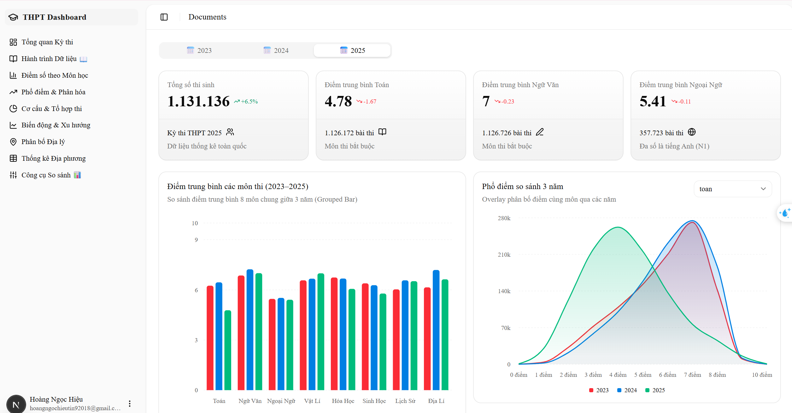
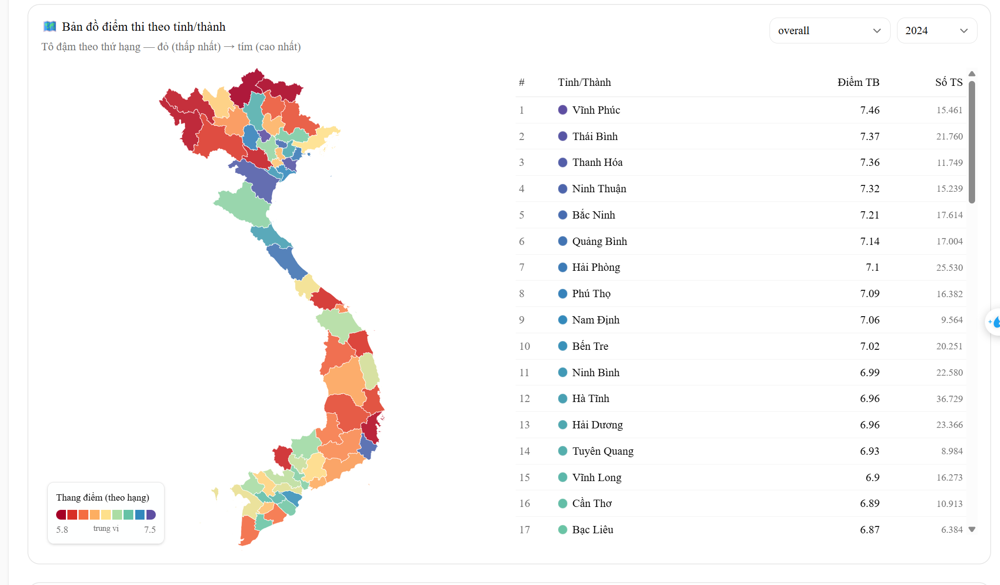
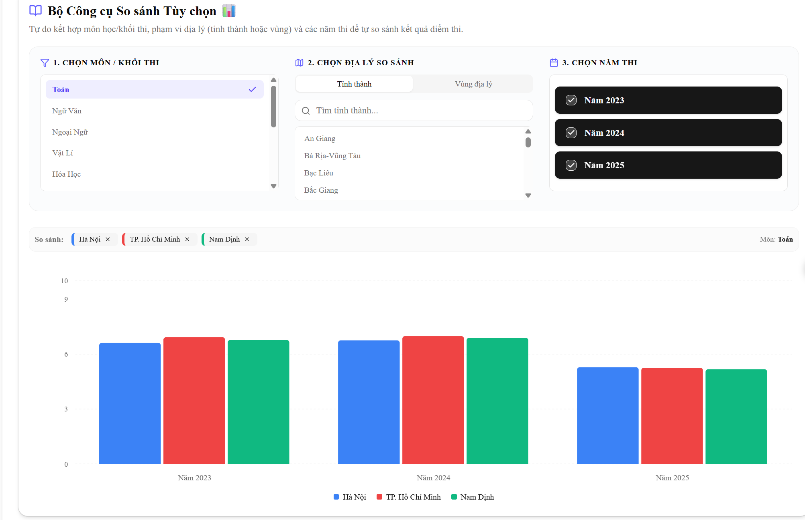

# 📊 Vietnam THPT Exam Dashboard (2023–2025)

An interactive, high-performance web dashboard for analyzing Vietnam's National High School Graduation Examination (THPT) results across 2023, 2024, and 2025.

Bảng điều khiển tương tác trực quan phân tích dữ liệu điểm thi tốt nghiệp THPT Quốc gia giai đoạn 2023 - 2025.

---

## 📸 Demo Screenshots / Hình ảnh Minh họa

### 1. Dashboard Overview / Tổng quan Bảng điều khiển


### 2. Multi-Year Comparisons / So sánh Đối chiếu Liên năm


### 3. Interactive Choropleth Map / Bản đồ Nhiệt Địa lý


---

## 🇬🇧 English Version

### 🌟 Key Features
* **Interactive Choropleth Map**: Visualize national performance across 63 provinces using D3.js and GeoJSON maps with a quantile color scale.
* **Comprehensive Analytics**: Visual comparisons via Grouped Bar (average scores), Area (score distribution overlay), Radar (subject profile comparison), Line (multi-year trends), and Pie/Bar charts (KHTN vs KHXH participation).
* **3-Way Comparison Tool**: Customized analytics combining Subjects/Exam Blocks, Geography (provinces/regions), and Years.
* **Scrollytelling Journey**: Narrative-driven exploration (Chương 1 - 7) pairing text insights with live interactive charts.
* **Performance-First Pipeline**: Offline Node.js scripts compress millions of raw CSV/XLSX records into compact JSON static assets (~90 KB total) for 0ms runtime load time.

### 🛠 Tech Stack
* **Framework**: Next.js 16 (App Router) & React 19
* **Styling**: Tailwind CSS v4 & Shadcn UI
* **Data Visualization**: Recharts (for charts) & D3.js / `d3-geo` (for map rendering)
* **Data Prep**: Node.js (`csv-parser`, `xlsx`)

### 🚀 Getting Started

#### Prerequisites
* Node.js >= 18.0
* Raw CSV/XLSX data files placed in the parent directory (optional, only needed for regenerating JSON files)

#### Quick Run
```bash
# 1. Install dependencies
npm install

# 2. Process raw data (Only if data files are updated)
# node scripts/process-data.js
# node scripts/process-province-data.js

# 3. Start development server
npm run dev
```
Open [http://localhost:3000](http://localhost:3000) to view the application.

#### Build for Production
```bash
npm run build
npm run start
```

---

## 🇻🇳 Bản Tiếng Việt

### 🌟 Các Tính Năng Chính
* **Bản đồ nhiệt tương tác**: Trực quan hóa điểm số trung bình của 63 tỉnh thành Việt Nam sử dụng D3.js kết hợp bản đồ GeoJSON với thang màu Quantile phân nhóm thứ hạng khách quan.
* **Biểu đồ phân tích toàn diện**: Hỗ trợ nhiều dạng trực quan hóa bao gồm Cột nhóm (điểm trung bình), Miền (phổ điểm phân hóa), Mạng nhện (radar so sánh hồ sơ điểm), Đường (xu hướng liên năm), và Tròn/Cột ngang (tỉ lệ đăng ký tổ hợp KHTN/KHXH).
* **Bộ công cụ so sánh tự chọn**: Cho phép người xem tự động so sánh đối chiếu kết quả theo 3 chiều tùy chỉnh: Môn học/Khối thi × Tỉnh thành/Vùng miền × Năm học.
* **Kể chuyện dữ liệu (Scrollytelling)**: Dẫn dắt người dùng qua hành trình phân tích 7 chương, nội dung hiển thị bên trái đồng bộ với biểu đồ tương tác cập nhật bên phải khi cuộn trang.
* **Tối ưu hóa hiệu năng**: Dữ liệu thi khổng lồ (~2 triệu dòng) được xử lý offline qua các script Node.js thành các tệp JSON tĩnh gọn nhẹ (~90 KB), giúp ứng dụng load tức thì 0ms mà không cần gọi API máy chủ.

### 🛠 Công Nghệ Sử Dụng
* **Khung ứng dụng**: Next.js 16 (App Router) & React 19
* **Giao diện**: Tailwind CSS v4 & Shadcn UI
* **Thư viện biểu đồ**: Recharts & D3.js (`d3-geo`)
* **Tiền xử lý dữ liệu**: Node.js (`csv-parser`, `xlsx`)

### 🚀 Hướng Dẫn Cài Đặt & Chạy Nhanh

#### Yêu cầu hệ thống
* Cài đặt sẵn Node.js phiên bản từ 18.0 trở lên.

#### Khởi chạy dự án
```bash
# 1. Cài đặt các thư viện phụ thuộc
npm install

# 2. Tiền xử lý dữ liệu (chỉ cần chạy lại nếu có thay đổi file dữ liệu thô)
# node scripts/process-data.js
# node scripts/process-province-data.js

# 3. Chạy dev server
npm run dev
```
Truy cập [http://localhost:3000](http://localhost:3000) để trải nghiệm.

#### Biên dịch xuất bản
```bash
npm run build
npm run start
```

---

## 📂 Project Structure / Cấu trúc Thư mục
```
thpt-dashboard/
├── scripts/                  # Offline data processing scripts / Scripts xử lý dữ liệu thô
├── public/
│   └── vietnam-simplified.geojson  # Vietnam GeoJSON map / Bản đồ địa lý VN GeoJSON
├── src/
│   ├── app/
│   │   ├── globals.css       # Design tokens & CSS variables / Cấu hình Tailwind CSS & màu sắc
│   │   ├── layout.tsx        # Root layout / Bố cục chung
│   │   └── dashboard/
│   │       ├── page.tsx      # Main Dashboard / Trang bảng điều khiển chính
│   │       ├── data.json     # Compiled national stats / Dữ liệu tổng hợp toàn quốc
│   │       ├── province-data.json # Compiled provincial stats / Dữ liệu theo tỉnh thành
│   │       └── story/page.tsx # Scrollytelling page / Trang kể chuyện dữ liệu
│   └── components/
│       ├── app-sidebar.tsx   # Sidebar navigation / Thanh điều hướng trái
│       ├── vietnam-map-chart.tsx # Choropleth map component / Component bản đồ nhiệt
│       ├── comparison-tool.tsx   # Custom comparison tool / Bộ so sánh tùy chọn
│       └── *-chart.tsx       # Visualization charts / Các biểu đồ trực quan (Recharts)
```
